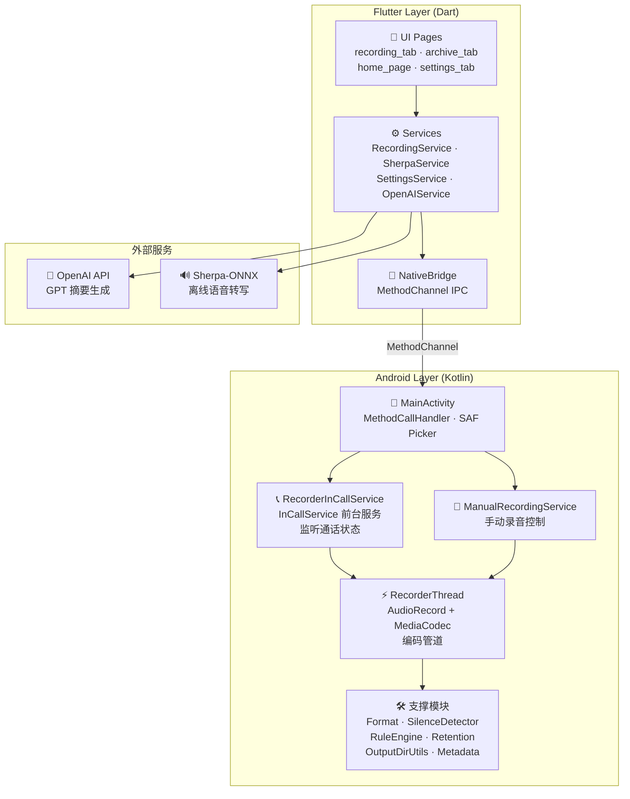
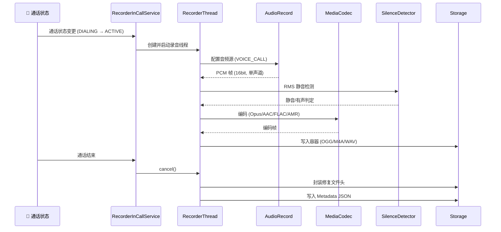
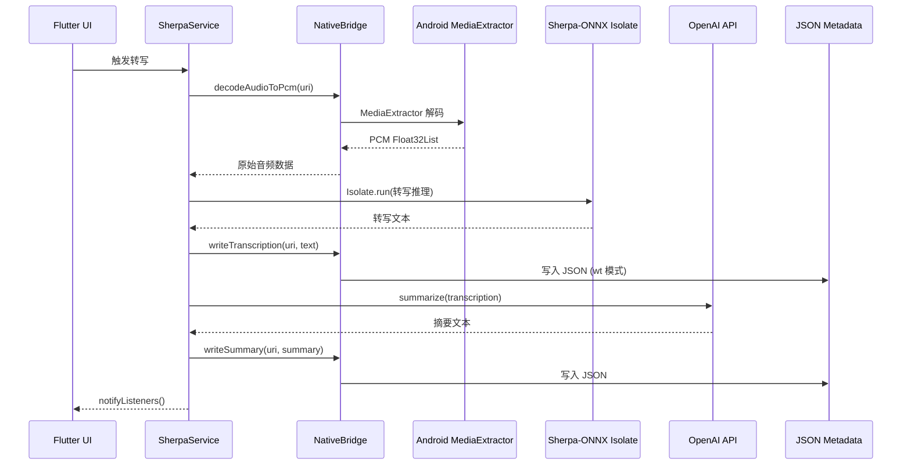
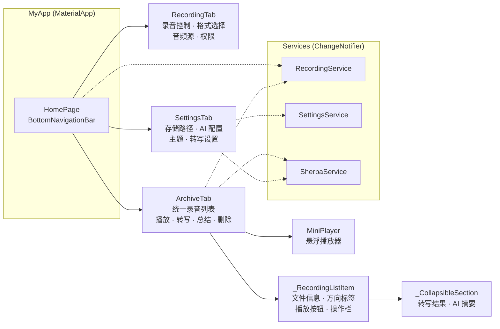

# ACR — Advanced Call Recorder

[](LICENSE)
[](https://developer.android.com)
[](https://flutter.dev)
[](https://kotlinlang.org)

高质量、全自动的 Android 通话录音应用。为 root 设备、自定义 ROM 及 Xposed/LSPosed 框架设计。

> **🎙️ Vibe Coding** — 本项目由 [Claude Code](https://claude.ai/code) 驱动开发，通过 Skill 编排多智能体协作完成全流程。

---

## 🏗️ 架构

### 系统总览



### 录音管道



### 离线转写 + AI 摘要管道



### 组件树



---

## ✨ 功能

### 通话录音

| 特性 | 说明 |
|------|------|
| **全自动触发** | `InCallService` 监听通话状态，来电/去电自动开始录音 |
| **6 种输出格式** | Opus (OGG) · AAC (M4A) · FLAC · WAV (PCM) · AMR-WB · AMR-NB |
| **智能规则引擎** | 按号码、通话方向、SIM 卡槽设置录音规则（保存 / 暂停 / 丢弃 / 忽略） |
| **通配符匹配** | 号码模式支持 `*` 前缀/后缀匹配 |
| **前台通知** | 通话中常驻通知，支持暂停/恢复/保留/丢弃快捷操作 |
| **RMS 静音检测** | 均方根算法（默认 -40dBFS 阈值，90% 静音占比），自动丢弃无效录音 |
| **多音频源** | VOICE_CALL / VOICE_UPLINK_DOWNLINK / VOICE_UPLINK / VOICE_DOWNLINK |

### 手动录音

- 与通话录音共享同一 `AudioRecord` + `MediaCodec` 原生引擎
- 支持全部 6 种格式、自定义文件名模板、元数据 JSON
- 暂停/恢复、长按停止（带进度环动画）

### AI 增强

| 功能 | 实现 |
|------|------|
| **离线转写** | Sherpa-ONNX + SenseVoice，Dart Isolate 后台推理 |
| **AI 摘要** | OpenAI 兼容 API，转写完成后自动生成摘要回写 JSON |
| **自动轮询** | 可配置间隔（30s 默认），扫描新录音自动转写 |
| **容错恢复** | JSON 损坏时自动 `salvageJson()` 恢复可读部分 |

### 文件管理

- **SAF 输出** — 用户可选择任意目录（SD 卡 / 外部存储）
- **统一归档** — 通话录音和手动录音在同一列表展示
- **方向标签** — 来电 / 去电 / 会议 颜色区分
- **内联播放** — just_audio + ExoPlayer 原生支持 `content://` URI
- **元数据 JSON** — 侧车文件（通话详情、格式参数、录音指标、转写、摘要）
- **伴生文件同步** — 删除音频时自动清理 `.json` / `.log` / `.logcat`
- **自动清理** — 按天数保留策略删除过期文件

### UI

- **Material Design 3** — `ColorScheme.fromSeed()` 动态主题，tonal surface 层级
- **底部导航** — 录音 / 归档 / 设置三 Tab
- **暗色模式** — 亮色/暗色/跟随系统
- **Firebase Auth** — Google 登录（无 GMS 设备优雅降级）
- **DirectBoot** — 未解锁设备可录音，解锁后自动迁移

---

## 🚀 安装

### 方式一：Magisk / KernelSU 模块（推荐）

1. 下载最新 `acr-vX.Y.Z-ksu.zip`
2. 在 Magisk / KernelSU Manager 中刷入
3. 重启设备

### 方式二：手动安装为系统 priv-app

```bash
adb push app-release.apk /system/priv-app/studio.unicom.acr/studio.unicom.acr.apk
adb push privapp-permissions-studio.unicom.acr.xml /system/etc/permissions/
adb reboot
```

### 方式三：Xposed / LSPosed 模块

1. 安装 APK
2. 在 LSPosed Manager 中启用 ACR 模块
3. 选择推荐的作用域（电话、通讯录）

## 🛠️ 构建

**环境要求**：Flutter 3.x · Android SDK 34+ · JDK 21

```bash
git clone git@github.com:UnicomAndroid/ACR.git
cd ACR
flutter pub get
flutter build apk --release
# 输出: build/app/outputs/flutter-apk/app-release.apk
```

---

## 📦 技术栈

| 层 | 技术 | 用途 |
|:---|:---|:---|
| **UI** | Flutter 3.x + Material 3 | 跨平台声明式 UI，动态主题 |
| **状态** | ChangeNotifier + ListenableBuilder | 服务层状态广播 |
| **IPC** | MethodChannel | Flutter ↔ Android 双向通信 |
| **音频播放** | just_audio + ExoPlayer | `content://` URI 原生播放 |
| **音频捕获** | AudioRecord | 直接从音频硬件读取 PCM |
| **音频编码** | MediaCodec + MediaMuxer | Opus/AAC/FLAC/AMR 硬件编码 |
| **语音转写** | Sherpa-ONNX + SenseVoice | Dart Isolate 离线推理 |
| **AI 摘要** | OpenAI 兼容 API | GPT 摘要生成 |
| **序列化** | kotlinx-serialization-json | 元数据 JSON 读写 |
| **号码** | libphonenumber-android | 电话号码格式化与匹配 |
| **Xposed** | libxposed (API 101.0.0) | LSPosed 模块接口 |
| **认证** | Firebase Auth + Google Sign-In | 用户登录 |
| **存储** | SAF (Storage Access Framework) | content:// URI 外部存储 |

---

## 🤝 致谢

本项目基于 **[BCR (Basic Call Recorder)](https://github.com/chenxiaolong/BCR)** 的原生录音引擎，由 **Andrew Gunnerson** 开发并维护。

- 原始项目 © 2022-2026 Andrew Gunnerson
- `RecorderThread`、`Format` 抽象、`OutputDirUtils`、`SilenceDetector`、`RuleEngine` 等核心模块继承自 BCR
- Flutter UI、MethodChannel IPC、手动录音服务、AI 转写/摘要、Material 3 主题为新增实现

**特别感谢 Andrew Gunnerson 和 BCR 项目的所有贡献者。**

## 🎙️ Vibe Coding

本项目采用 Vibe Coding 模式——与 AI 结对编程，Claude Code 作为主要编码代理：

- **AI 模型**：Claude Code (Anthropic)
- **工作流**：Skill 系统 + 多智能体协作（Plan → Explore → Implement → Review）
- **全栈覆盖**：Kotlin 原生层、Flutter UI 层、MethodChannel IPC、AI 集成

> "不是 AI 替你写代码，而是你和 AI 一起 Vibe。"

## 📄 许可

本项目基于 **GPL-3.0-only** 许可发布。详见 [LICENSE](LICENSE)。

```text
SPDX-FileCopyrightText: 2022-2026 Andrew Gunnerson
SPDX-FileCopyrightText: 2026 UnicomAndroid
SPDX-License-Identifier: GPL-3.0-only
```
